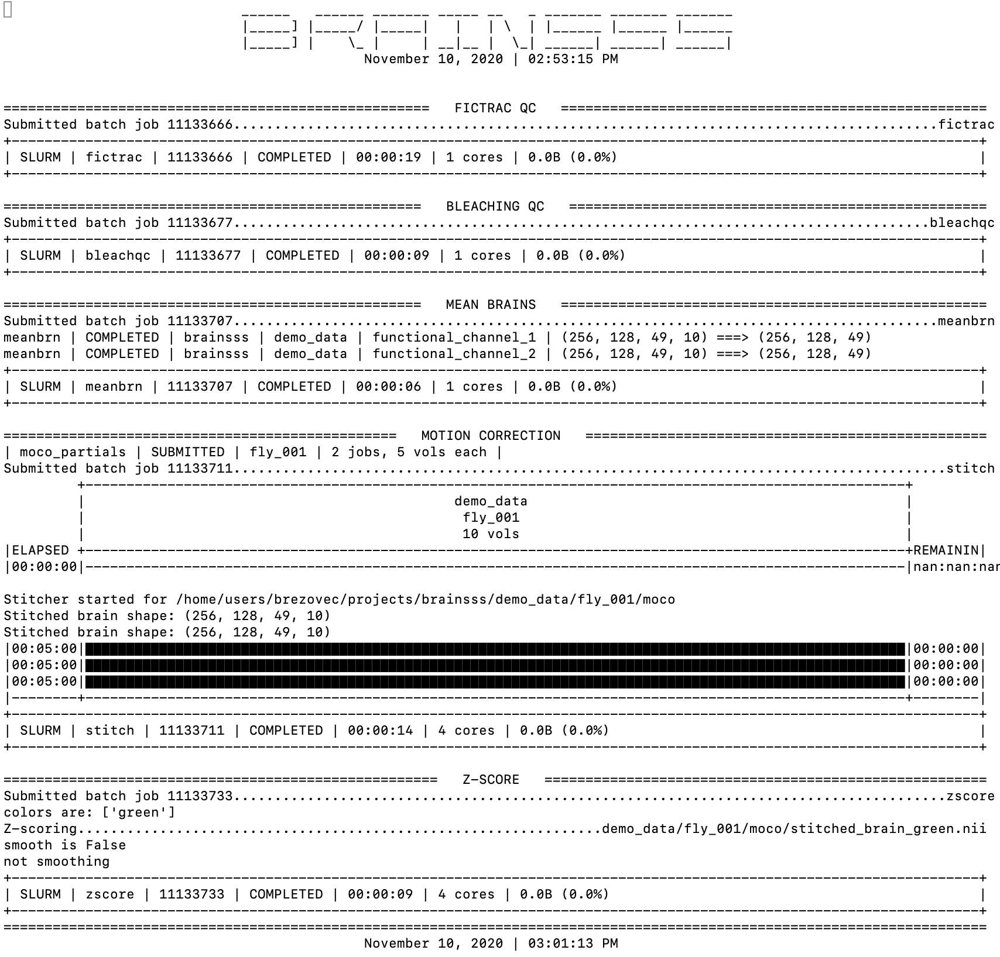

# brainsss
Preprocessing of volumetric neural data on sherlock (motion correction, zscoring, etc)

At its core, brainsss is a wrapper to interface with Slurm via python. It can handle complex submission of batches of jobs with job dependencies and makes it easy to pass variables between jobs. It also has full logging of job progress, output, and errors.

For clarity, this package currently only contains a few functions to demonstrate its usage (and includes some demo data). One function that may be particularly useful is motion correction.

Installing the package:  
First, add our lab's custom modules to you modulepath (allows access to ANTs, a brain-warping tool) by adding:  
```export MODULEPATH=/home/groups/trc/modules:$MODULEPATH``` to your
```~/.bashrc```  
you will need to source to load the changes:  
```source ~/.bashrc```

login to sherlock and navigate to where you would like to install this package.  
```shell
> git clone https://github.com/ClandininLab/brainsss.git
> cd brainsss
> ml python/3.6.1
> pip3 install -e . --user
```
change the paths:  
  - in scripts/main.sh, line 13 must point to scripts/main.py
  - in scripts/main.py, scripts_path, com_path, and dataset_path must be set

Running the demo:  
```shell
cd scripts
sbatch main.sh
```
progress and errors will be printed into a file in the scripts/logs folder.  
mainlog.out keeps track of all the times the script was run, as well as high-level errors. 
Once the job launches, a log with a date-time string will be created and messages will continue to be appended to it until the job is complete.  
The demo should perform and print information about Fictrac QC, Bleaching QC, creation of meanbrains, Motion Correction, and Z-scoring.  

Example log file:


*** (Jolie) - you will possibly see errors in the mainlog.out file, about certain packages not being able to import. You will need to install these packages using pip3 install. Let me know if this happens, and if so which packages you needed to install so I can add it to this readme. And let me know if you need help with this, but basically you will type ```pip3 install "package name" --user```

Upon completion, the demo_data directory should contain some new files:
- /fly_001/fictrac will contain a velocity trace and a 2D histogram
- /fly_001 will contain a "bleaching" figure, the meanbrains for each channel, as well as the z-scored motion-corrected green-channel brain
- /fly_001/moco will contain each channel motion corrected, as well as a figure of x/y/z translations involved in the motion correction.

A few notes on parameters:  
- this toy data set only contains 10 timepoints, giving arrays of [256,128,49,10] (x,y,z,t).
- A more standard functional array will be [256,128,49,3384], for which I recommend during moco:
  - partials: step=100, mem=4, time_moco=4
  - stitcher: mem=12, time=2
- For an anatomical volume, of roughly [1024,512,200,100], I recommend:
  - step=10, mem=7, time_moco=6
- for z-scoring these large functional volumes, I recommend mem=18
