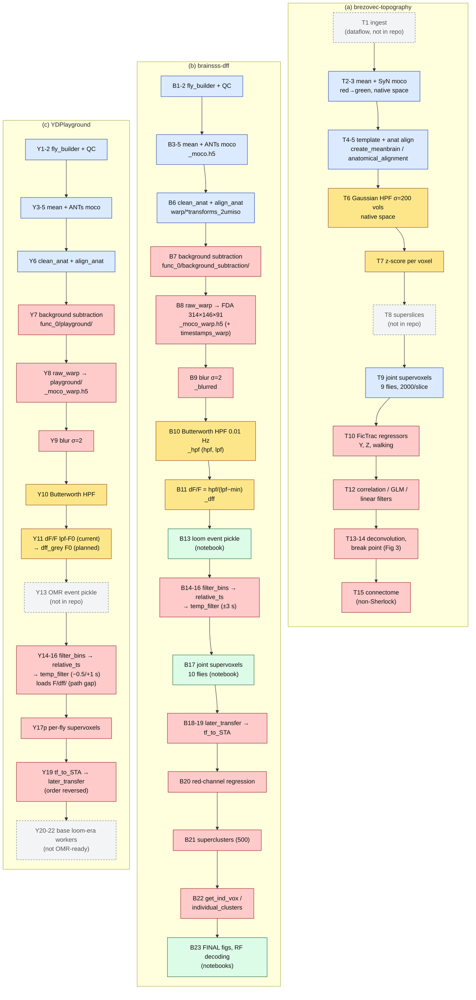

# Analysis flow: topography vs. brainsss-dff vs. YDPlayground

End-to-end data flow in three codebases, stage by stage:
- **(a)** `refs/brezovec-topography`;
- **(b)** `refs/brainsss-dff` at `e25e58b`;
- **(c)** this repo's `scripts/` on `YDPlayground`.

Builds on [brezovec-topography.md](brezovec-topography.md) and [brainsss-dff.md](brainsss-dff.md); see those for per-function details, constants and bugs. Surveyed 2026-10-02.

Tags: **[from code]** = read in the file; **[inferred]** = interpretation.

**Conventions**
- `F` = `fly_NNN/` under `dataset_path`. `ch` = channel number. `{beh}` = behaviour key from the event pickle. `{ev}` = `-e` event label.
- "Slurm" means the stage runs as a worker submitted by `brainsss.sbatch` from `preprocess.py` / `postprocess.py`. The orchestrators are themselves Slurm jobs (`sbatch preprocess.sh`) [from code].
- "Interactive" means a Jupyter notebook. The notebooks contain no `sbatch` calls [from code]. They read Oak paths, so they run on Sherlock (e.g. OnDemand), not on a laptop [inferred].

## 1. Stage tables

### 1a. brezovec-topography

No file submits Slurm jobs. The `main(json.loads(sys.argv[1]))` workers expect an external orchestrator, presumably `dataflow/sherlock_scripts/main.py` [inferred]. Several files are excerpts that won't run as committed (topography map §0) [from code].

| # | Stage | Script → function(s) | Input | Output | Where |
|---|---|---|---|---|---|
| T1 | Ingest / build fly | *not in repo* (dataflow `fly_builder`) [inferred] | — | `F/func_0/imaging/`, `fictrac/` | — |
| T2 | Temporal mean | `preprocessing_neural_data.py` → `make_temporal_mean` | 4-D array | mean volume (in memory) | in-memory snippet [from code] |
| T3 | Motion correction (red → green) | same file → `motion_correct_single_volume` (ANTs **SyN**), `apply_transforms_from_red_to_green_channel` | per-volume arrays | arrays; **nothing saved** [from code] | snippet; the real run used dataflow `moco_partial`/`moco_stitcher` [inferred] |
| T4 | Template building | `create_meanbrain.py` → `clean_anat`, `sharpen_anat`, `align_anat`, `avg_brains` | `raw_anats/*.nii`, seed fly 91 | `clean_anats/`, `sharp_anats/`, `affine_0/1`, `syn_0[_sharp].nii` | `__main__` script; host not stated [inferred: Sherlock] |
| T5 | Anat alignment (fly → template, func → anat) | `anatomical_alignment.py` → `main(args)` (ANTs) | `moving_path`, `fixed_path` `.nii` | `{moving}-to-{fixed}[_lowres].nii`, `…_fwdtransforms/`, `…_invtransforms/` | Slurm worker (external orchestrator) [inferred] |
| T6 | High-pass | `preprocessing_neural_data.py` → `high_pass_filter` | 4-D array | `brain − gaussian(σ=200 vols) + mean` | in-memory snippet [from code] |
| T7 | Normalise | same → `z_score` | 4-D array | per-voxel z-score over the session. **No ΔF/F** [from code] | in-memory snippet |
| T8 | Superslices (all flies concatenated per z) | *not in repo* [from code: no builder] | — | `20201129_super_slices/superslice_{z}.nii` (256×128, 9 flies × 3384 t) | — |
| T9 | Supervoxels (joint over flies) | `supervoxel_creation.py` → `create_clusters` (Ward, 2000/slice) | `superslice_{z}.nii` | `final_9_cluster_labels_2000.npy`. Downstream reads `cluster_labels.npy` [from code] | snippet |
| T10 | Behaviour regressors | `load_behavior_fictrac.py` → `load_fictrac`, `Fictrac.*` (savgol 25/3, 50 fps) | `F/func_0/fictrac/*.dat`, `imaging/` timestamps | Y, Z, `_pos`/`_neg`, `walking` (in memory) | inside each analysis worker [from code] |
| T11 | z-depth correction map | *not in repo* | — | `F/warp/20201220_warped_z_depth.nii` | — |
| T12a | Correlation maps | `correlation_analysis.py` → `main` | superslices, labels, fictrac, timestamps | `rvalues_{beh}_z{z}.npy`, `pvalues_…` | Slurm worker [inferred] |
| T12b | Unique-variance GLM | `instantaneous_glm_unique.py` → `main` (`RidgeCV`) | same + z-depth map | `20210208_inst_uniq_glm/Z{z}.pickle` | Slurm worker [inferred] |
| T12c | Linear filters (activity-weighted behaviour) | `linear_filters.py` ≡ `cross_correlation_analysis.py` → `build_timeshifted_behavior_matrix`, `build_X` | same | `master_X.npy`, `responses_{z}.npy` | Slurm worker [inferred] |
| T13 | Deconvolution | `deconvolution.py` → `fit_eq` (GCaMP6f kernel), Toeplitz least squares | `responses_*.npy` | in memory | snippet |
| T14 | Break point (Fig 3) | `find_temporal_break_point.py` | `20230202_SC_temporal_filters.npy` (500 superclusters) | in memory | snippet |
| T15 | Connectome | `adjacency_matrix.py`, `connectome_*` | hemibrain pickles, FDA, GLM/correlation maps | `adjacent_supervoxel.h5`, in-memory sets | **Not Sherlock** (`/home/data/...`) [inferred] |

**Order** [from code]:
- Topography high-passes and z-scores **in native functional space** (256×128×49). It concatenates flies in space it never documents, and analyses **supervoxels**.
- There is no spatial blur, no background subtraction and no stimulus alignment.

### 1b. brainsss-dff (`e25e58b`)

All numbered stages are Slurm workers launched from the orchestrators, except B13 and the notebooks [from code]. Pre-processing is identical to the common base. The only `dff`-side changes are in postprocess ([brainsss-dff.md](brainsss-dff.md) §1).

| # | Stage | Script → function(s) | Input | Output | Where |
|---|---|---|---|---|---|
| B1 | Build fly | `fly_builder.py` (`--build_flies`) | `imports_path/<date>/` (Bruker `.nii`/XML), `data/fictrac/<user>`, `WBI_shared/visual` | `F/{func_0,anat_0}/imaging/{functional,anatomy}_channel_{1,2}.nii`, `F/func_0/{fictrac,visual}/`, `F/fly.json`; the built paths go to stdout | Slurm |
| B2 | QC | `fictrac_qc.py` → `load_fictrac`, `smooth_and_interp_fictrac`; `bleaching_qc.py` | `fictrac/`, `imaging/*.nii` | `fictrac/*.png`, `imaging/bleaching.png` | Slurm |
| B3 | Mean brain (pre) | `make_mean_brain.py` | `imaging/*_channel_{1,2}.nii` | `…_channel_N_mean.nii` | Slurm |
| B4 | Motion correction | `motion_correction.py` (ANTs, master ch 1 → mirror ch 2) | `imaging/functional_channel_{1,2}.nii` + mean | `func_0/moco/functional_channel_N_moco.h5` (same for anat) | Slurm |
| B5 | Mean brain (post) | `make_mean_brain.py` | `moco/*_moco.h5` | `…_moc_mean.nii`. The `file[:-4]` slice eats the `o` of `moco` [from code] | Slurm |
| B6 | Anat clean + alignment | `clean_anat.py`; `align_anat.py` (func2anat Affine, anat2atlas SyN to `20220301_luke_2_jfrc_affine_zflip_2umiso.nii`) | `anat_0/moco/anatomy_channel_1_moc_mean[_clean].nii`, `func_0/moco/functional_channel_1_moc_mean.nii` | `F/warp/func-to-anat_fwdtransforms_2umiso/`, `F/warp/anat-to-meanbrain_fwdtransforms_2umiso/` (+inv) | Slurm |
| B7 | Background subtraction | `background_subtraction.py` → `BgRemover3D.draw_bg/remove_bg` (darkest 10-px x-window per y,z line, subtracted per timepoint, **+500 offset**) | `func_0/moco/functional_channel_N_moco.h5` | `func_0/background_subtraction/functional_channel_N_moco.h5`. **Same filename, no suffix** [from code] | Slurm |
| B8 | Warp to FDA template | `raw_warp.py` → `brain_utils.warp_raw` (func→anat affine + anat→meanbrain SyN), `load_fda_meanbrain` | B7 output + `F/warp/*transforms_2umiso` | `F/warp/functional_channel_N_moco_warp.h5` (314×146×91) | Slurm |
| B8t | Warp timestamps | `timestamp_warp.py` → `load_timestamps` | `func_0/imaging/` XML / `timestamps.h5` | `F/warp/timestamps_warp.h5` (ms, per voxel) | Slurm |
| B9 | Spatial blur | `blur.py` (3-D gaussian σ=2 per volume) | `F/warp/…_moco_warp.h5` | `F/dff/…_moco_warp_blurred.h5` | Slurm |
| B10 | High-pass | `butter_highpass.py` → `apply_butter_highpass` (order 2, 0.01 Hz, fs=1.8, `filtfilt`) | `…_blurred.h5` | `F/dff/…_blurred_hpf.h5` (`hpf`, `lpf = brain − hpf`) | Slurm |
| B11 | ΔF/F | `dff.py` (`hpf / (lpf − global min)`) | `…_hpf.h5` | `F/dff/…_hpf_dff.h5` | Slurm |
| B12 | (optional) h5 → nii | `h5_to_nii.py` | `…_dff.h5` | `…_dff.nii` | Slurm |
| B13 | **Event pickle** | `HOWTO_split_behavior.ipynb` → `load_photodiode`, `extract_stim_times_from_pd`, `extract_traces`, inc/dec/flat rule | `func_0/visual/`, `fictrac/` | `later/{ev}_event_times_split_dic.pkl` | **Interactive** |
| B14 | Bin edges | `filter_bins.py` (±3000 ms) | `F/warp/timestamps_warp.h5`, pickle | `scratch/F/filter_needs_{ch}_{beh}_{ev}.h5` | Slurm (bigmem) |
| B15 | Relative time + in-window mask | `relative_ts.py` | timestamps, `filter_needs_*` | `scratch/F/ts_rel_odd_mask_{ch}_{beh}_{ev}.h5` | Slurm (bigmem) |
| B16 | Temporal filter (event-aligned re-sort) | `temp_filter.py` | `F/dff/…_dff.h5` + B14 and B15 (copied to scratch) | `F/temp_filter/…_dff_filtered_{beh}_{ev}.h5` (`brain`, `time_stamps`) | Slurm (bigmem) |
| B17 | Joint supervoxels | `HOWTO_create_supervox_mask.ipynb` (Ward 2000/slice over 10 flies' `…_filtered_total.h5`) | `F/temp_filter/…_2_…filtered_total.h5` | `later/temp_filter/clustering/10flies_cluster_labels_best_flies.npy` | **Interactive** |
| B17p | Per-fly supervoxels | `make_supervoxels.py` | `…_filtered_{beh}.h5` | `F/func_0/clustering/cluster_{labels,signals}_{ch}_{beh}_2000.npy` | Slurm. **Does not parse** [from code] |
| B18 | Transfer to staging | `later_transfer.py` | `F/temp_filter/…_filtered_{beh}_{ev}.h5` | `scratch/tf/{beh}/{fly}_tf_{beh}_{ch}_{ev}.h5` | Slurm |
| B19 | Group STA | `tf_to_STA.py` (−3000…3000, 100 ms bins; mean per fly, then across flies) | `scratch/tf/{beh}/*` | `later/temp_filter/{beh}/STA_{ch}_{beh}_100_{ev}.h5`; then deletes scratch inputs | Slurm |
| B19p | Per-fly STA | `build_STA.py` → `STA_supervoxel_to_full_res` | per-fly clustering + `…_filtered_{beh}.h5` | `F/STA/stepsize_100_STA_{beh}.h5` | Slurm |
| B20 | Red-channel regression | `regress_noise.py` → `make_multi_behave_dict`, `dual_channel_remove_noise` | `STA_{1,2}_*_{ev}.h5` | `later/temp_filter/behave_dict_total_{ev}.pkl` | Slurm |
| B21 | Superclusters | `supercluster.py` → `vox_to_full_res`, Ward (3-D) | `behave_dict_total_{ev}.pkl`, B17 labels, `behave_dict_total_10flies.pkl` | `clustering/supercluster_labels_total_500.npy` (fit once), `superclust_clusters_500_{ev}.pkl` | Slurm |
| B22a | Per-fly 2-bin superclusters | `get_ind_vox.py` | `F/temp_filter/*`, supercluster labels | `clustering/individual_fly_superclusters_2bin_total.pkl` | Slurm |
| B22b | Per-trial cluster values | `individual_clusters.py` | Ilana's `F/dff`, `F/warp` timestamps (hardcoded), labels | `later/{fly}_[after_]individual_clusters_new_ch_{ch}_dict_{ev}.pkl` | Slurm |
| B23 | Figures / decoding | `*_FINAL.ipynb` (z-score, Mann-Whitney, KMeans, random forest) | B19–B22 outputs | figures | **Interactive** |

Orchestrator step order (`postprocess.py`) [from code]:
`filter_bins → relative_ts → temp_filter → make_supervoxels → later_transfer → tf_to_STA → build_STA → regress_noise → supercluster → get_ind_vox → individual_clusters`.

### 1c. YDPlayground `scripts/`

Same workers as (b) for B1–B12 and B14–B22, so only the differences are listed. Everything here is Slurm except the event pickle and the notebooks [from code].

| # | Stage | Difference from (b) |
|---|---|---|
| Y7 | Background subtraction | Saves under `func_0/playground/background_subtraction/` (`e81b20e`) [from code]. |
| Y8 | Raw warp | Loads `func_0/playground/background_subtraction/`, writes `func_0/playground/functional_channel_N_moco_warp.h5`. Not written to `F/warp/` [from code]. Timestamps still go to `F/warp/timestamps_warp.h5` [from code]. |
| Y9–Y11 | Blur → HPF → ΔF/F | Same scripts and suffixes (`_warp_blurred`, `_hpf`, `_dff`), all in `func_0/playground/` [from code]. Same lpf-F0. |
| Y11′ | **Planned**: grey-period F0 | `F/func_0/dff_grey/F0_{stationary,moving}_channel_2.h5`, per `CLAUDE.md` → Data rules. **No script yet** [from code: no writer in repo]. |
| Y13 | Event pickle (OMR) | **No builder in this repo** [from code: no tracked file creates `event_times_split_dic`]. Labels expected downstream: `syn_turn_{0,180}`, `anti_turn_{0,180}`, `flat_{0,180}`, `total` (hardcoded in `build_STA.py`) [from code]. Path: `later_path` = `.../Yandan/2P_Imaging/optomotor_response_analysis` [from code: `users/yandanw.json`]. |
| Y14 | Bin edges | −500/1100 ms (effective end 1000); events sorted [from code]. |
| Y16 | Temporal filter | `postprocess.py` still loads `F/dff/…_dff.h5`, **not** `func_0/playground/` [from code]. Either symlink the outputs or repoint this before running [inferred]. |
| Y17p | Per-fly supervoxels | `make_supervoxels.py` parses (re-indented); `func_path = F/func_0` [from code]. |
| Y18/Y19 | Transfer → group STA | **Order is reversed**: `tf_to_STA` runs *before* `later_transfer` [from code]. A single bulk run computes the STA from an empty or stale `scratch/tf/`. Window −500/1000 [from code]. No scratch deletion [from code]. |
| Y19p | Per-fly STA | Range −1000/1000, so the first 5 bins fall outside the filter window [inferred: all-NaN]. |
| Y20–Y22 | regress_noise, supercluster, get_ind_vox, individual_clusters | Base versions, unchanged from `cf9fcf5` [from code]. They still read the 10-fly loom files (`behave_dict_total_10flies.pkl`, `cluster_labels_best_flies.npy`, Ilana's paths in `individual_clusters`). Not usable for OMR as-is (see [brainsss-dff.md](brainsss-dff.md) §5). |

## 2. Diagram

The rows are aligned by stage. Stages with the same colour are equivalent in purpose, though not in method. Dashed boxes mean the stage is not in that repo's code.

**Legend:**
- Blue: shared purpose.
- Amber: same step done differently (high-pass, normalisation).
- Red: present in only one lineage.
- Green: interactive notebook.
- Grey dashed: not in that repo's code.

## 3. Where the flows diverge

| Stage | Topography (a) | dff (b) | YD (c) |
|---|---|---|---|
| Ingest / QC | — (dataflow) | ✓ | ✓ |
| Moco | SyN per volume (snippet) | ANTs `motion_correction.py` | same as (b) |
| Background subtraction | ✗ | ✓ (+500 offset) | ✓ (into `playground/`) |
| Space for signal processing | **native** 256×128×49 | **FDA template** 314×146×91, warped *before* filtering | same as (b) |
| Spatial blur | ✗ | σ=2 | σ=2 |
| High-pass | Gaussian σ=200 vols | Butterworth 0.01 Hz, fs=1.8 | same as (b) |
| Normalisation | z-score | lpf-F0 ΔF/F | lpf-F0 now; `dff_grey` F0 planned |
| Supervoxels | joint, 9 flies, on z-scored superslices | joint, 10 flies, on loom `total` temp-filtered data (notebook) + broken per-fly script | per-fly script (works) |
| Behaviour input | continuous FicTrac regressors | discrete events (photodiode) split by behaviour | discrete OMR events (builder missing) |
| Event alignment (temp_filter chain) | ✗ | ✓ ±3 s | ✓ −0.5/+1 s |
| z-depth timing correction | ✓ (`warped_z_depth`) | ✗; per-voxel warped timestamps instead | same as (b) |
| Group STA | ✗ (filters instead) | `tf_to_STA` | `tf_to_STA` (runs before transfer) |
| Red-channel regression | ✗ | ✓ | base version, loom files |
| Superclusters | 500 (code not in repo) | ✓ 500, fit on loom | base version |
| Decoding / stats | correlation, GLM, filters, deconvolution | Mann-Whitney, KMeans, random forest | — |
| Connectome | ✓ | ✗ | ✗ |

**Stages that exist in only one flow**
- **Only topography** [from code]:
  - continuous-regressor correlation, GLM and linear filters;
  - GCaMP deconvolution;
  - break-point analysis;
  - z-depth timing correction;
  - connectome analyses;
  - template construction (`create_meanbrain`).
- **Only brainsss (b and c)** [from code]:
  - fly building and QC;
  - background subtraction;
  - warping data into the FDA template before filtering;
  - spatial blur;
  - Butterworth high-pass and ΔF/F;
  - the event-aligned `filter_bins → relative_ts → temp_filter` chain;
  - group STA.
- **Only dff (b)**:
  - the notebook-built event pickle and the joint 10-fly supervoxel mask [from code];
  - working `later_transfer → tf_to_STA` ordering, scratch cleanup, `bigmem` [from code];
  - RF decoding in the FINAL notebooks [from code].
- **Only YD (c)**:
  - the `playground/` output tree [from code];
  - the planned `dff_grey` F0 [from code: `CLAUDE.md`];
  - a parsing `make_supervoxels.py` [from code].
- **Missing everywhere**:
  - the topography superslice builder and z-depth map;
  - the YD OMR event-pickle builder.

## 4. Gaps to close before an OMR run on YDPlayground

From the tables above:
1. **No event-pickle builder.** Write a script, not a notebook, that produces `{ev}_event_times_split_dic.pkl` with your OMR labels [from code: none exists].
2. **Output path mismatch.** `postprocess.py` `temp_filter` loads `F/dff/`, but your preprocess writes `func_0/playground/` [from code].
3. **Step order.** Swap so `later_transfer` runs before `tf_to_STA`, as on dff [from code].
4. **Missing `dff_grey` F0.** Nothing writes or reads it yet, and every downstream step still consumes `…_hpf_dff.h5` (lpf-F0) [from code].
5. **Loom-only workers.** `regress_noise`, `supercluster`, `get_ind_vox` and `individual_clusters` still point at 10-fly loom files or Ilana's paths [from code].
